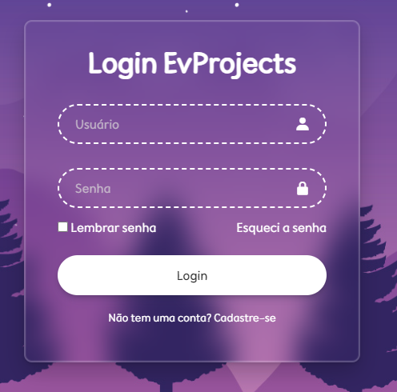

# Login EvProjects

Interface de **tela de login moderna** desenvolvida com HTML e CSS, com foco em design, usabilidade e efeitos visuais como *glassmorphism* (efeito de vidro).

> Projeto baseado em tutorial do YouTube, com personalizações no layout, cores e estrutura.

---

## 📸 Preview



> Interface com efeito glassmorphism, fundo com imagem e campos estilizados.

---

## 📖 Sobre o projeto

A **Login EvProjects** simula uma tela de autenticação com um visual moderno e responsivo. O projeto foi desenvolvido para praticar conceitos fundamentais de front-end, como:

* Estruturação com HTML
* Estilização com CSS
* Posicionamento de elementos
* Efeitos visuais (blur, transparência e sombras)

---

## 🚀 Funcionalidades

* Campo de usuário com ícone
* Campo de senha com ícone
* Checkbox "Lembrar senha"
* Link "Esqueci a senha"
* Botão de login com efeito hover
* Link para cadastro
* Layout centralizado e estilizado

---

## 🎨 Destaques visuais

* Efeito **glassmorphism** com `backdrop-filter`
* Bordas arredondadas e suaves
* Ícones utilizando Boxicons
* Fundo com imagem personalizada
* Inputs com borda tracejada estilizada

---

## 🛠️ Tecnologias utilizadas

* HTML5
* CSS3
* Boxicons (biblioteca de ícones)
* Google Fonts

---

## ▶️ Como executar

1. Clone o repositório:

```
git clone https://github.com/evelyntecinternet/Tela-de-Login
```

2. Abra a pasta do projeto

3. Execute o arquivo index.html no navegador

---

## 📌 Aprendizados

* Criação de interfaces modernas
* Uso de flexbox para centralização
* Estilização avançada com CSS
* Aplicação de efeitos visuais (blur e transparência)

---

## 🔧 Melhorias futuras

* Validação de formulário com JavaScript
* Integração com backend (login real)
* Responsividade completa para mobile

---

## 💡 Diferencial do projeto

Este projeto se destaca pelo cuidado com o design visual, aplicando conceitos modernos como:

* Glassmorphism (efeito de vidro)
* Uso de ícones integrados aos inputs
* Interface limpa e centralizada

Mesmo sendo um projeto simples, o foco foi criar uma interface bonita e organizada.

---

## 👩‍💻 Autora

**Evelyn Oliveira**

---

## ⭐ Apoie

Se gostou do projeto, deixe uma estrela ⭐ no repositório!
